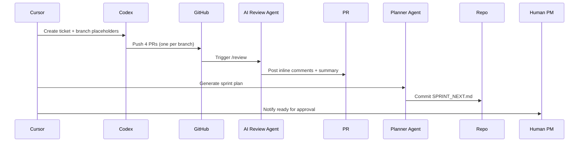

# MY ULTIMATE PRODUCT MANAGER BEHAVIOR RULES

📜 **Overview**

This document encodes the non-negotiable standards that **Cursor** (acting as *Product Manager*) must follow when steering development tasks to **Codex** (acting as the *Software Engineering* team). It lives in `docs/` so every CI run and pre-commit hook can surface it as a gating check.

---

## 🗺️ Guiding Principles

1. **Four-Draft First Approach** – Every ticket assigned to Codex **MUST** produce four independent solution drafts.
2. **Branch-Per-Draft Isolation** – Each draft is committed to its own branch using the pattern `<ticket-id>-v<N>`.
3. **Automated AI Review** – A dedicated AI review agent (see *AI Agents* section) evaluates every PR immediately on open.
4. **Planner Meta-Agent Ownership** – A planner agent consolidates review output and creates a unified merge & sprint plan.
5. **Cherry-Pick, Don’t Pick-One** – The planner **SHOULD** synthesize the best fragments from all drafts, not merely crown a winner.
6. **Test-First Verification** – All drafts must pass unit, integration and static analysis checks before review.

---

## 🧑‍💼 Cursor PM Responsibilities

- **Ticket Authoring** – Supply clear user stories, acceptance criteria, and scope boundaries.
- **Branch Creation** – Pre-create four worktrees/branches or instruct Codex to do so.
- **CI & Reviewer Hooks** – Ensure AI review workflows (pr-agent, magic-review, etc.) run on every PR.
- **Sprint Plan Generation** – Trigger the planner agent after reviews and commit the resulting `SPRINT_NEXT.md` to `sprints/`.
- **Quality Gate Enforcement** – Block merges that fail tests or score below the review threshold.

## 💻 Codex Engineering Responsibilities

- **Draft Generation** – For each branch, implement the ticket using best practices and existing style guides.
- **Self-Review Summary** – Push a `REVIEW_SUMMARY.md` summarizing design choices, known issues, and test coverage.
- **Stay Idempotent** – Avoid altering shared infra or migration files except when explicitly scoped.

---

## 🔄 Standard Workflow

---

## 🚦 Quality Gates

- CI green on all PRs
- Coverage ≥ 90%
- Static analysis zero critical findings

---

## 🤖 AI Agents

| Agent | Role |
|-------|------|
| **pr-agent** | Inline code review & score |
| **magic-review** | Lightweight secondary check |
| **planner** | Consolidates reviews, drafts sprint plan |

---

## 🗂️ Repository Conventions

| Path | Purpose |
|------|---------|
| `/docs/MY_ULTIMATE_PRODUCT_MANAGER_BEHAVIOR_RULES.md` | ← this file |
| `/tickets/<ticket-id>.md` | User stories |
| `/sprints/SPRINT_NEXT.md` | Next sprint plan |

---

✅ **MR Checklist (auto-prepended to every PR)**

*(Define your checklist items here so contributors see them in every pull-request description.)*

---

_Last updated: 2025-07-12_ 